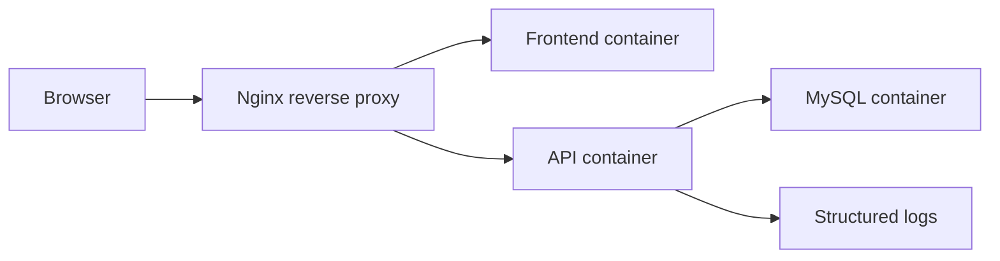

# DevOps Practice Stack

โปรเจกต์ฝึก DevOps แบบ full-stack ขนาดกลาง ประกอบด้วย Vite React TypeScript + Tailwind CSS, Express.js, MySQL, Nginx reverse proxy และ Docker Compose orchestration

## Architecture



## Services

- `frontend`: Vite React app served by Nginx
- `backend`: Express.js API with MySQL connection pool
- `mysql`: MySQL 8 with init scripts, seed data, and persistent volume
- `proxy`: Nginx edge service routing `/` and `/api`
- `adminer`: optional DB UI profile for local debugging
- `jenkins`: optional CI server profile for local Jenkins practice

## Quick Start

```powershell
Copy-Item .env.example .env
docker compose up --build
```

เปิด:

- App: http://localhost
- API health: http://localhost/api/health
- Adminer: `docker compose --profile tools up adminer`
- Prometheus + Grafana: `docker compose --profile observability up -d`
- Jenkins: `docker compose --profile ci up -d jenkins`

## Local Development

```powershell
Copy-Item .env.example .env
npm install
npm run dev:backend
npm run dev:frontend
```

Frontend: http://localhost:5173

Backend: http://localhost:3000

## Useful Commands

```powershell
npm run dev:backend
npm run dev:frontend
npm run lint
npm run typecheck
npm run build
npm run docker:up
npm run docker:down
npm run docker:logs
```

## DevOps Practice Goals

1. Build and run a multi-container app with Compose
2. Understand networking between containers
3. Add health checks and readiness checks
4. Use environment variables and secrets safely
5. Practice migrations and seed data
6. Debug app, proxy, and database logs
7. Scrape metrics with Prometheus and visualize with Grafana
8. Prepare Jenkins CI/CD steps for build, test, image publish, deploy

## Jenkins CI

Pipeline as code อยู่ที่ [Jenkinsfile](Jenkinsfile)

Jenkins agent ควรมี:

- Node.js 22
- npm
- Docker CLI และ Docker Compose plugin
- PowerShell ถ้าจะรัน `scripts/smoke-test.ps1`

เปิด Jenkins local lab:

```powershell
docker compose --profile ci up -d jenkins
```

จากนั้นเปิด http://localhost:8081 แล้วสร้าง Pipeline job ที่ชี้มาที่ repo นี้

หมายเหตุ: Jenkins service ใน Compose ใช้ custom image จาก [infra/jenkins/Dockerfile](infra/jenkins/Dockerfile) เพื่อให้มี Docker CLI และ Docker Compose plugin สำหรับรัน pipeline ที่ build image ได้

อ่านไกด์เต็มได้ที่ [docs/devops-guide.md](docs/devops-guide.md)
